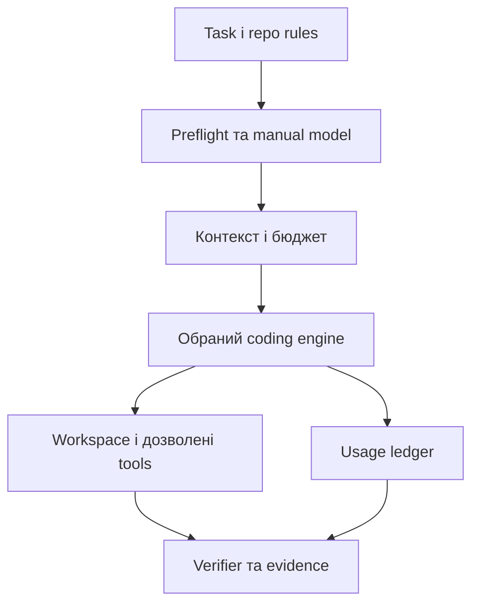

# Implementation Map: компоненти й контракти окремого Coding Agent

**APPROVED як карта реалізації · редакція 1.0 · власник підтвердив 25.09.2026.** Це схвалена карта майбутньої реалізації, **не вибір рушія, пакета, мови чи конкретного API**. Scope і Product DoD — [VISION.md](VISION.md), послідовність — [ROADMAP.md](ROADMAP.md), правила роботи над цим проєктом — [AGENTS.md](AGENTS.md). Назви вузлів описують відповідальності, а не наперед вибрані процеси.

## 1. Архітектурні варіанти, які ще порівнюємо

| Підхід | Що вже є | Що пишемо окремо | Головна невідомість |
|---|---|---|---|
| **CLI wrapper** | Agent edit loop, інструменти й provider інтеграція відкритого CLI. | Task/repo preflight, запуск, workspace rules, звіт, невелика telemetry інтеграція. | Чи видно й контролюємо всі model calls і shell/file effects. |
| **Hybrid supervisor** | Той самий engine плюс його події/SDK. | Ручний picker, context policy, usage ledger, окремий verifier і task lifecycle. | Ціна підтримки адаптерів та реальні hooks. |
| **Малий власний API loop** | Провайдерські SDK / відповідна open-source бібліотека, `rg`, готові патерни edit. | Керований виклик моделі, tool bridge, patch/sandbox, retries, context management. | Чи зможемо досягти якості та безпеки CLI без зайвої складності. |

**Рішення R1** приймають за фактичним trace, ліцензією, безпекою й вартістю прийнятої задачі. Fork — запасний шлях для підтвердженого блокера, не варіант за замовчуванням.

## 2. Логічні вузли та відповідальності

| Вузол | Вхід → вихід | Відповідальність і fail condition |
|---|---|---|
| Task loader | Task spec + target repo → нормалізована задача і source provenance. | Перевіряє обов’язкові поля; не дозволяє task file розширити repo policy. Конфлікт → stop. |
| Repo policy adapter | `AGENTS.md`/правила, стан Git, за потреби NODREN docs → дозволені scope/branch/actions. | Читає чинні джерела. Для NODREN перевіряє issue/dependencies/phase gate; немає evidence → stop. |
| Manual provider picker | Явний provider, endpoint alias, model, параметри → immutable run snapshot. | Підтверджує capability/credentials без запису ключа; забороняє automatic fallback і невраховані auxiliary models. |
| Context selector | Обов’язкові джерела + `rg` результати → уривки з path/revision/digest. | Віддає спочатку must-not/acceptance, потім локалізований код; контекст не обрізує критичні правила. |
| Engine adapter | Snapshot + task/context + дозволені tools → model events / candidate patch. | Нормалізує events/capabilities, забороняє приховану зміну моделі, обмежує кроки. Може бути wrapper над CLI або API loop. |
| Workspace/command guard | Base revision + дозволені paths/commands → isolated diff + логи. | Запобігає конфлікту, symlink/path escape, зміні чужих dirty files. Worktree не замінює sandbox. |
| Usage/budget ledger | Provider/engine usage + price provenance → per-call/per-task telemetry. | Розрізняє фактичне, повідомлене engine й оцінене; `UNKNOWN` зберігається як unknown. Не обіцяє strict cap без interception. |
| Verification/report | Diff + фактичні exit codes + criteria + usage → звіт і статус. | Відрізняє `passed`, `failed`, `not_run`, `blocked`; не називає роботу завершеною лише за self-review моделі. |

### Пропонована файлова карта майбутнього репозиторію

Це **не створені зараз файли** й не рішення про Python/TypeScript. Суфікс `.*` означає розширення після вибору мови у R1. Якщо готовий CLI повністю реалізує вузол, тонкий adapter може замінити кілька модулів.

| Майбутній шлях | Єдина відповідальність | Пов'язані вимоги |
|---|---|---|
| `src/task/task_loader.*`, `src/task/task_contract.*` | Парсинг та валідація task spec. | CA-R02 |
| `src/policy/repo_preflight.*`, `src/policy/nodren_adapter.*` | Чинні правила цільового repo; NODREN checks як додатковий адаптер. | CA-R01, CA-R09 |
| `src/model/manual_selection.*`, `src/model/engine_adapter.*` | Вибір провайдера/моделі, capability handshake, модельні події. | CA-R03, CA-R04 |
| `src/context/selection.*` | `rg`, пріоритети mandatory/optional джерел, ліміт контексту. | CA-R05 |
| `src/workspace/patch_guard.*`, `src/workspace/command_guard.*` | Diff, захист шляхів і сторонніх змін, обмежене виконання. | CA-R08, CA-R09 |
| `src/usage/ledger.*`, `src/usage/pricing.*` | Нормалізація токенів, price provenance, `UNKNOWN`, soft budget. | CA-R06, CA-R07 |
| `src/verify/checks.*`, `src/report/evidence.*` | Запуск реальних перевірок і звіт із exit codes/diff. | CA-R08 |
| `tests/fixtures/`, `tests/negative/`, `docs/decisions/` | Контрольні репозиторії, заборонені сценарії, запис прийнятого engine/ліцензій. | Product DoD |

Початковий PR/task не повинен створити всі каталоги «на майбутнє»: додавати лише те, що потрібно для конкретного прийнятого етапу.

## 3. Task contract (пропозиція, не чинний стандарт NODREN)

Файл на кшталт `tasks/task-XXX.md` містить: `task_id`, репозиторій і за потреби issue/backlog ID, дозволену branch та шляхи, мету, authoritative sources із версіями/посиланнями, `must_do`, `must_not`, acceptance, дозволені перевірки, потрібні інструменти/обмеження shell/network, stop rule. API ключі й реальні секрети **ніколи** не потрапляють у task spec.

Парсер відмовляє, коли відсутня мета/acceptance, scope суперечливий, джерела поза repo-policy або обов’язкова перевірка не існує. Якщо запуск лише на тестовому repo без backlog policy, `issue_id` може бути відсутнім; для NODREN діють **його** правила, а не це послаблення. Шлях `tasks/` у NODREN ще не підтверджений як його поточна схема.

## 4. Run lifecycle та відновлення

1. **Preflight:** repo rules → branch/dirty → task/source validation → вибір моделі й price/status. Всі рішення фіксуються до model call.
2. **Read:** локальний `rg`, вузьке завантаження файлів із ревізіями; для NODREN manifest `source_sections` → лише потрібні canonical parts. Попередня оцінка контексту з позначенням tokenizer.
3. **Plan:** короткий план і цільові файли; зіставити must-not, acceptance і дозволи. Повний репозиторій не надсилати у prompt.
4. **Edit:** згенерувати кандидатний edit. Для search/replace вимагати унікальний збіг і очікуваний вміст/хеш; для diff перевірити base, шляхи і hunks. Невідповідність → точна помилка, обмежена retry; не «підлаштовувати» fuzzy patch непомітно.
5. **Verify:** `git diff --check`, відповідні тести/типи/lint/build лише якщо реальні та дозволені; зберегти exit codes і короткі діагнози, повні логи локально.
6. **Review/stop:** показати незмінені вимоги, diff, результати acceptance, витрати, незавершеність. Пауза/відновлення повторно перевіряє source hashes, branch, dirty state, price/model snapshot; при дрейфі stop або новий явний запуск.

**Стан помилки:** `BLOCKED` для дозволів/невідомої ціни за потрібного cost cap/небезпечного середовища; `REWORK_REQUIRED` для failed test чи порушеного критерію; `COMPLETE_FOR_REVIEW` лише після реальних перевірок. Ці назви — пропозиція для SCA, не імпортована machine specification NODREN.

## 5. Токени, вартість і контроль

**Дані одного виклику:** `run_id`, `step_id`, request ID (якщо є), provider/model/endpoint alias, `observed_source`, input/output tokens, cache read/write/reasoning (якщо повернено), `estimated_context_tokens`, `price_source/date`, `estimated_cost` або `UNKNOWN`, status/time; prompts і secrets не записувати за замовчуванням. Не вважати cache/read/reasoning додатковими до input/output без конкретної схеми provider — можливий подвійний облік.

**Preflight контексту:** зарезервувати місце для repo rules, task must-do/must-not, acceptance, поточних помилок і `max_output`; додаткові snippets обмежити залишком. Для невідомого tokenizer показати оцінку як approximate і не робити точного твердження про provider ліміт. В разі переповнення зупинити/скоротити лише optional snippets; не стискати authoritative constraints мовчки.

**Три різні режими бюджету:** (1) monitor — повідомлене usage після виклику; (2) soft stop — попередження і зупинка **до наступного контрольованого кроку**; (3) strict cap — окрема функція, потрібен pre-call hook над усіма model calls, верхня оцінка prompt + reserved max output і актуальна ціна. Звичайний лог `ccusage` не здійснює (3). У підписковому CLI API-еквівалентні USD не рівні балансу підписки.

**Як перевіряємо зменшення витрат:** парні задачі з тією самою моделлю й правилами → baseline без оптимізації проти selective context/tool output limits; `USD per accepted task`, відсоток прийняття, регресії, latency, cached usage. Prompt caching — можливість provider, не гарантія бібліотеки. Будь-яка compaction зберігає must-not, acceptance, provenance окремо від summary.

## 6. Reuse map: відкритий код із GitHub

Класи: **A** цілий engine напряму за підтвердженої сумісності; **B** зовнішня dependency/CLI; **C** повторити патерн без тісної code coupling; **D** вивчити пізніше; **E** уникати. Вибір пакета залежить від мови та R1 spike, тому рядки — **кандидати**, не зафіксований dependency lock.

| Компонент | Клас | Причина/перевірка | Ліцензійна межа |
|---|---|---|---|
| [ccusage](https://github.com/ccusage/ccusage) | B | Історичний локальний CLI/JSON для багатьох coding CLI; перевірити зіставлення run ID та формат log конкретного engine. Не використовувати як live cap. | [MIT](https://github.com/ccusage/ccusage/blob/main/apps/ccusage/LICENSE). |
| [tiktoken](https://github.com/openai/tiktoken) | B | Локальний estimate для моделей OpenAI; перевірити відхилення від API usage. Не використовувати для всіх providers. | [MIT](https://github.com/openai/tiktoken/blob/main/LICENSE). |
| [tokencost](https://github.com/AgentOps-AI/tokencost) | B умовно | Python estimate/cost, перевірити поточність підтримуваних model IDs, latency й розбіжність. | [MIT](https://github.com/AgentOps-AI/tokencost/blob/main/LICENSE). |
| [models.dev](https://github.com/anomalyco/models.dev) | B як pinned data | Каталог параметрів/тарифів; не довіряти прайсу без дати та звірки з provider. | [MIT](https://github.com/anomalyco/models.dev/blob/dev/LICENSE). |
| [Aider](https://github.com/Aider-AI/aider) | A як engine? / C repo map | Перевірити CLI/правки/модельний контроль; tree-sitter map лише після `rg` baseline. | [Apache-2.0](https://github.com/Aider-AI/aider/blob/main/LICENSE.txt). |
| [OpenCode](https://github.com/anomalyco/opencode), [Codex CLI](https://github.com/openai/codex), [mini-swe-agent](https://github.com/SWE-agent/mini-swe-agent) | A як engine? / C патерни | Кандидати R1; перевірити актуальні ліцензії **точних** версій, hook, shell/permissions, manual model. Жоден не обраний за замовчуванням. | Верифікація версій перед lock; [mini-swe-agent MIT](https://github.com/SWE-agent/mini-swe-agent/blob/main/LICENSE.md). |
| [OpenHands software-agent-sdk](https://github.com/OpenHands/software-agent-sdk) | D / C compaction | SDK ширший за MVP; дивитися на контекстні патерни, якщо виникне потреба. | [MIT](https://github.com/OpenHands/software-agent-sdk/blob/main/LICENSE). |
| [LiteLLM](https://github.com/BerriAI/litellm) | D / B SDK умовно | Може спростити Python multi-provider adapter; повний proxy/DB для одного користувача зайвий. Без DB деякі бюджети не обмежують витрати. | [MIT поза enterprise/](https://github.com/BerriAI/litellm/blob/main/LICENSE). |
| Автоматичний model router, необмежений shell, silent `$0` на missing price | E | Суперечить ручному вибору, безпеці й чесному моніторингу. | Не переносити як поведінку зі стороннього engine. |

Публікація GitHub потребує перевірки notices, transitive licenses, trademarks і ліцензій конкретних частин. Публічний repo ≠ дозвіл копіювати будь-який код; відкритий інструмент ≠ безплатна inference-послуга. Claude Code — можливий зовнішній backend за чинними умовами, **не** open-source код для reuse.

## 7. Робота з NODREN як цільовим repo

Першим кроком прочитати [його AGENTS.md](https://github.com/Vasyl-Slyvka/NODREN/blob/main/AGENTS.md), [docs authority](https://github.com/Vasyl-Slyvka/NODREN/blob/main/docs/README.md), [manifest](https://github.com/Vasyl-Slyvka/NODREN/blob/main/docs/uk-UA/canonical%20parts/canonical_parts_manifest.json), [accepted ADRs index](https://github.com/Vasyl-Slyvka/NODREN/blob/main/docs/adr/index.json) й актуальний issue. Коли потрібна Vision/Plan, parts підбирати за `source_sections`, DOCX лишається canonical; невідповідність — stop. У перевіреному 25.09.2026 [P0 record](https://github.com/Vasyl-Slyvka/NODREN/blob/main/docs/evidence/p0/acceptance/P0_ACCEPTANCE_RECORD.json) має `p1_authorized=false`. З часом статус може змінитися: перечитати його до зміни файлів.

Сторонній agent shell/Git не отримує ширші повноваження, ніж дозволені активним NODREN issue. Наявність окремого worktree не дає права створювати branch, commit чи PR усупереч його AGENTS.md; для кожної дії потрібна авторизація цільового repo.

## 8. Контрольні експерименти й рішення після них

| Спайк | Відповідь, потрібна для R2 |
|---|---|
| Два вручну вибрані provider/model | Чи всі internal model calls збігаються з явним вибором? Чи можлива заміна між окремими запусками без правки task file? |
| Звіт `ccusage` vs provider usage | Чи не губляться calls, reasoning/cache? Чи можна співвіднести з run, де лише API-equivalent USD? |
| Тест бюджету й cancel | Що реально зупиняється, і коли? Чи здатен engine гарантувати per-call interception? |
| Patch/dirty/security | Чи збережено user work, відхилено path escape, чи виконуються тільки дозволені команди? |
| Економія контексту | Чи падають токени *на прийняту задачу* без втрати must-not/acceptance? |

Якщо жоден готовий engine не проходить виміряний gate, тоді аргументовано вибрати більш керований підхід. Це висновок експерименту, не прихована перевага власного loop.
