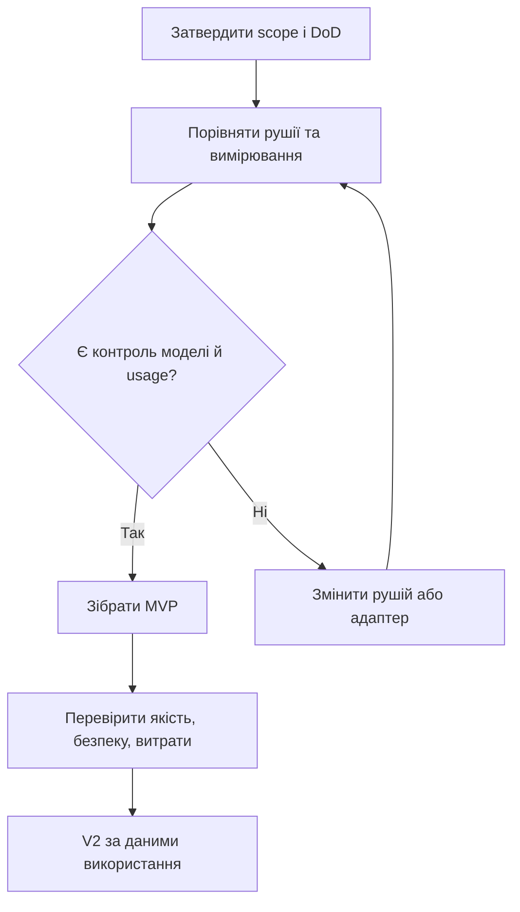

# Roadmap: окремий Coding Agent

**APPROVED як план етапів · редакція 1.0 · власник підтвердив 25.09.2026.** Ці етапи стосуються лише Standalone Coding Agent (SCA); **не** є фазами P0–P5 NODREN. Вимоги та Product DoD — [VISION.md](VISION.md). Затвердження roadmap не означає, що R0/R1 виконано чи обрано рушій.

## Рішення і послідовність

[S08 — request/usage ledger від 02.10.2026](docs/slices/012-request-ledger.md): офлайнова кореляція supplied IDs, явні auxiliary/retry records і UNKNOWN; це не live interceptor або повний provider trace. Старий smoke не переатрибутовано; R1 відкритий. Наступний вузький adapter спершу перевіряється локальним mock server.

[S07 — публічний WIP від 01.10.2026](docs/reviews/2026-10-01-public-readiness.md): README, офлайновий приклад і автоматичні перевірки. Публікація не закриває R1 або Product DoD; ліцензійне рішення SCA лишається відкритим.

[Повне рев’ю S06 від 26.09.2026](docs/reviews/2026-09-26-full-review.md) фіксує перевірений scope, виправлення та незакриті критерії DoD. Воно не закриває R1.

**Поточне виконання по слайсах:** S01 — офлайновий task/Git preflight із [звітом](docs/slices/001-preflight.md); S02a — синтетичний стенд і telemetry contract із [звітом](docs/slices/002-benchmark-foundation.md); S02b.0 — [статичний аудит інтерфейсів](docs/slices/003-static-engine-audit.md); S02b.1 — [офлайновий аналізатор подій](docs/slices/004-offline-trace-audit.md); S02b.2 — [звірка з upstream CLI та €0 тестовий маршрут](docs/slices/005-free-test-path.md); S02b.3 — [живий локальний smoke test](docs/slices/010-local-engine-smoke.md), який знайшов третій виклик моделі поза двома CLI step; повний S02b/R1 **відкритий**, порівняльного engine/telemetry spike немає; S03a — [офлайновий контракт ручного вибору](docs/slices/006-selection-snapshot.md); S03b — [офлайновий usage gate](docs/slices/007-usage-gate.md) для наступного контрольованого кроку; повний S03 — picker з engine integration і нормалізацією usage після R1 gate; S04a — [офлайнове прев’ю правки](docs/slices/008-patch-preview.md) без запису; S04b — [офлайновий добір контексту](docs/slices/011-context-pack.md); повний S04 — обмежені workspace edits/commands; S05a — [офлайновий аудит метаданих доказів](docs/slices/009-evidence-audit.md) без запуску команд; повний S05 — verifier/evidence та інтеграційний DoD. Цей поділ деталізує R1–R2 і **не вибирає engine наперед**. Підготовчі слайси — Python standard-library експерименти; мова фінального engine залишається відкритою.

**Тимчасовий порядок через бюджет €0 та відсутність ноутбука:** два локальні запуски на одній моделі виявили допоміжний HTTP-запит поза CLI step usage; вони не закривають S02b/R1. Відновити порівняння з класифікацією й provider usage кожного запиту та двома API-провайдерами, коли ці ресурси будуть доступні. До gate R1 дозволені незалежні офлайнові контракти без вибору рушія, заяв про економію або виконаний MVP.

### R0. Узгодження дизайну

**Виконано 25.09.2026:** власник переглянув і схвалив Vision, Roadmap, Implementation Map, README та AGENTS.md, зокрема ручний вибір двох API-провайдерів у MVP. Для €0 локального досліду вже використано Linux CPU й синтетичний repo; S02a містить чотири відтворювані фікстури. **Перед повним порівняльним spike ще потрібні:** спільне середовище для кандидатів, дві API-конфігурації та допустимий бюджет/безплатний доступ. Engine та конкретні API залишаються відкритими рішеннями.

**Критерій переходу:** узгоджено середовище й бюджет, підібрано безпечні синтетичні задачі; scope й вимоги до моніторингу вже прийняті. Рішення «який engine» тут **не потрібне**. **Стан R0: частково виконано; операційні входи R1 залишаються відкритими.**

### R1. Короткий інженерний spike, вибір engine

**Порівняти мінімум три технічні шляхи:** (A) готовий відкритий CLI як engine + wrapper; (B) CLI + supervisor із власними task/context/usage правилами; (C) малий власний API loop з готовими відкритими dependencies. CLI кандидатів узяти з Aider, Codex CLI, OpenCode, mini-swe-agent або іншого вільного репозиторію після перевірки ліцензії та режиму запуску. Claude Code можна виміряти як зовнішній виконуваний backend за його умовами, але **не** класифікувати як відкритий код для копіювання.

**Мінімальні фікстури:** проста зміна, два залежні файли, must-not, помилка API, відсутній прайс, незакомічений файл, prompt injection у repo, збій тестів, спроба автоматичного fallback/hidden summary call. Використати ті самі моделі/ціни і максимально однакові умови; якщо конкретний engine не підтримує модель, позначити порівняння як непарне.

**Доказ:** trace всіх видимих модельних викликів і файлових/shell дій, час, токени, кеш, фактичні й оцінені USD, ліцензія, точки зупинки.

**Gate R1 → R2:** обраний шлях реально дозволяє вручну фіксувати модель, перевірити два різні API-провайдери, безпечно обмежити дії і отримувати достатню per-call telemetry **або** чітко визначити, який вузький адаптер це виправить. Якщо існують непомітні виклики або неможливо зупиняти небезпечні дії, цей engine не відповідає MVP без додаткової роботи.

### R2. MVP — одна задача за раз

| Крок | Результат | Перевірка |
|---|---|---|
| 2.1 Task + repo preflight | Прочитано task spec, локальні `AGENTS.md`/правила, `HEAD`, branch, dirty; NODREN adapter читає лише релевантні parts за manifest. | Missing/contradictory requirements, неавторизований branch або gate блокують edits. |
| 2.2 Manual provider/model | Вибір двох перевірених API-провайдерів і моделей через CLI config; незмінний snapshot на run. | Окремий запуск через кожного provider, trace без інших model calls. |
| 2.3 Робочий цикл | `rg` → вибір файлів → короткий план → edit patch у безпечному workspace → вузькі дозволені test/lint/typecheck → diff. | Patch із невірним hash/конфліктом відхиляється; dirty не губляться. |
| 2.4 Usage + бюджет | Зібрано provider/engine usage, `UNKNOWN` для відсутньої ціни, step/time/output limits, soft stop у точці, яку реально контролюємо; optional `ccusage` для минулих CLI logs. | Негативні кейси переповнення контексту, невідомої ціни і перевищення soft budget. Гранулярність моніторингу показана чесно. |
| 2.5 Review + evidence | Фінальний diff, відомості про джерела контексту, команди та exit codes, usage/cost provenance, невирішені критерії. | Реальний happy path і failure path відтворюються без commit/push. |

**Gate MVP:** виконано Product DoD із [VISION.md](VISION.md), перевірено 2 provider/API, негативні сценарії збереження й безпеки, frozen dependencies/licenses. Якщо один provider недоступний — це обмежений prototype, **не** виконаний MVP із ручним вибором API. Перед роботою з NODREN окремо потрібен дозволений issue та чинний phase gate.

### R3. V2 після роботи з MVP

- Ручна зміна моделі/провайдера всередині активної задачі на контрольній точці з новими лімітами, ціною і audit segment.
- Надійніше resume/checkpoints та per-task dashboard; алерти за витратами й якістю, але без прихованого роутингу.
- Summary/compaction, якщо на довгих задачах показано користь і must-not/acceptance зберігаються verbatim.
- Strict pre-call token/USD cap **лише** якщо потрібен; вимагає перехоплення всіх запитів і перевіреного прайсу. Це окремий gate без припущення, що готовий CLI його дає.

### R4. Пізні оптимізації за доказами

Repo/symbol maps, AST-aware retrieval, prompt caching оптимізації, окремі sandbox profiles, паралельні worktrees, підтримка додаткових providers/локальних моделей. Кожна функція потребує контролю проти простого `rg` baseline: вартість *прийнятої* задачі, тривалість, correctness, регресії.

## Свідомо не входить до R0–R2

Багатокористувацький gateway, векторна БД на кожну задачу, автоматичне призначення дешевої моделі, автономний merge/push/deploy, форк великого engine заради косметичної зміни, складна група паралельних агентів. Будь-яке перенесення між етапами змінюється явно у Vision/Implementation Map із поясненням витрат і впливу на DoD.

## Орієнтовний backlog майбутньої реалізації

Це **порядок робіт**, не авторизація змін NODREN і не оцінка тривалості. Після R1 кожен пункт перетворити на малу задачу з критеріями прийняття:

1. Контракт задачі й preflight; фікстури порушених правил.
2. Обраний engine adapter і ручний провайдер/модель; trace та негативний тест на fallback.
3. Безпечне робоче середовище/patch та збереження dirty files.
4. `rg` context selector, token budget для mandatory і optional context.
5. Usage ledger, lookup ціни, soft stop та коректне `UNKNOWN`.
6. Verification runner і evidence report.
7. Комплект парних benchmark задач, security/permission негативні тести й ліцензійний інвентар.

Після кожного пункту перевірити diff, scope, критерії й документацію. Негативний тест входить у прийняття вузла, а не відкладається на кінець.
